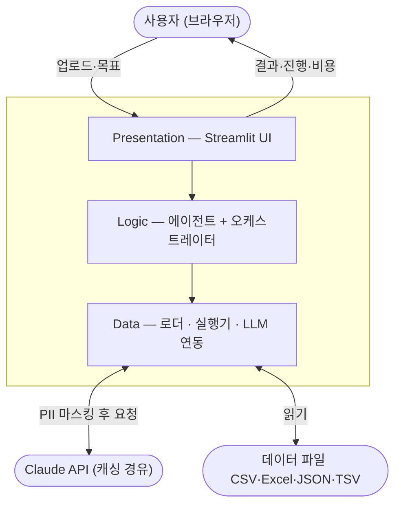

# AutoML Pipeline — LLM 기반 ML 모델 자동 생성·검증 파이프라인

[](https://github.com/youngkuen/LLMops-pipeline/actions/workflows/tests.yml)

> 정형 데이터를 업로드하면 LLM이 분석 계획을 세우고, ML 코드를 **생성 → 방법론 검증 → 실행 → 진단 → 자동 개선**까지 수행하는 End-to-End 파이프라인.


---

## 이 프로젝트가 푸는 문제

> **"LLM이 생성한 ML 코드를 어떻게 신뢰할 수 있는가?"**

LLM에게 "이 데이터로 모델 만들어줘"라고 하면 그럴듯한 코드를 주지만, 실제로는 **데이터 누수(data leakage)**, **잘못된 교차검증**, **재현 불가능한 랜덤성** 같은 ML 방법론 오류가 숨어 있기 쉽습니다. 이런 코드는 "정확도 99%"처럼 보이지만 실전에서는 무너집니다.

이 프로젝트는 LLM의 생성 능력에 **정적 분석 기반 검증 게이트**와 **자동 개선 루프**를 결합해, 생성된 코드가 방법론적으로 건전한지 기계적으로 검증한 뒤에만 실행하도록 설계했습니다.

---

## 핵심 엔지니어링 결정

### 1. 정규식 → AST 기반 방법론 검증 (`ml_gates.py`)
생성된 코드를 6개 규칙(데이터 누수, 교차검증 무결성, SMOTE 순서, 평가셋 분리, 시계열 분할, 재현성)으로 검증합니다.

- **문제**: 초기엔 정규식으로 `X_test` 같은 문자열을 찾았지만, `xt = X_test` 후 `xt`를 쓰면 우회됐습니다.
- **해결**: `ast.parse`로 구문 트리를 분석하고 **변수 별칭 체인을 끝까지 추적**하도록 재작성. sklearn의 고정 반환 순서(`train, test, ...`)로 변수의 실제 역할을 판별하므로 이름을 바꿔도 탐지됩니다.

### 2. 통합 개선 루프 (`orchestrator.py`)
단발성 LLM 호출이 아니라, **검증 실패 → 피드백 → 재생성**을 자동화한 이중 루프 구조입니다.

- **안쪽 루프**: 게이트 위반 시 위반 내용을 대화에 추가해 코드 재생성 (최대 3회)
- **바깥 루프**: 실행 결과의 성능이 기준에 못 미치면 진단 피드백을 반영해 재시도 (최대 3라운드)

### 3. 개인정보(PII) 자동 탐지·마스킹 (`anonymizer.py`)
컬럼명 패턴 + 값 샘플링으로 이메일·전화·주민번호 등을 탐지하고, **LLM에 텍스트가 전달되는 지점(명세서 분석·결과 진단)에서만** 자동 마스킹합니다. (데이터 실행은 로컬 `exec`이라 외부로 나가지 않음)

### 4. 교체 가능한 LLM Provider + 캐싱 (`providers/`)
모든 에이전트는 `LLMProvider` 추상 인터페이스에만 의존합니다. `CachingLLMProvider`는 이 인터페이스를 감싸는 데코레이터라, 클라우드 API(Anthropic)뿐 아니라 향후 온프레미스 로컬 모델로도 구현체 교체만으로 전환 가능합니다. 토큰 사용량·비용도 함께 추적합니다.

---

## 아키텍처 (3-Tier)



- **Presentation → Logic → Data** 단방향 의존, 레이어 건너뛰기 금지
- `main.py`가 모든 구현체를 조립해 주입(DI)하고, 각 에이전트는 인터페이스에만 의존

> 상세 다이어그램(시퀀스·상태머신·게이트 로직)은 [`docs/architecture/architecture-diagrams.md`](docs/architecture/architecture-diagrams.md) 참고 — GitHub에서 자동 렌더링됩니다.

---

## 프로젝트 진화 과정

단발성 구현이 아니라 **최초 PoC → 분야 전문가(AI 공학) 자문 → 반복 개선**의 사이클로 발전시켰습니다. 대표적으로:

- **정규식 → AST 기반 방법론 검증**: 자문에서 "정규식은 변수명 변경으로 우회 가능"하다는 지적을 받고 AST 기반으로 재작성, 검증 항목도 3종 → 6종으로 확장
- **개선 루프 이중화** · **PII 마스킹(Data Layer)** · **데이터 형식 확장** · **시계열 지원** 등을 자문 피드백에 따라 순차 반영

> 전체 여정(v1 baseline → 자문 지적 → 반영한 개선 → 남은 로드맵)은 **[docs/EVOLUTION.md](docs/EVOLUTION.md)** 참고.

---

## 기술 스택

| 구분 | 사용 기술 |
|------|-----------|
| Language | Python 3.11 |
| UI | Streamlit |
| LLM | Anthropic Claude (`anthropic` SDK) |
| ML | scikit-learn, XGBoost, LightGBM, imbalanced-learn |
| Data | pandas, numpy, scipy |
| 검증 | Python `ast` (정적 분석 게이트) |
| Test | pytest (95 tests, 레이어별 분리) |

---

## 실행 방법

```bash
# 1. 의존성 설치
pip install -r requirements.txt

# 2. 환경변수 설정 (.env.example 참고)
cp .env.example .env
#   .env 파일을 열어 ANTHROPIC_API_KEY 를 채웁니다.

# 3. 실행
streamlit run app/main.py
```

`.env`는 `.gitignore`로 커밋되지 않습니다. API 키를 코드에 하드코딩하지 마세요.

### Docker로 실행

로컬에 Python을 설치하지 않고도, 어느 환경에서든 동일하게 실행할 수 있습니다.

```bash
# 1. 이미지 빌드
docker build -t automl-pipeline .

# 2. 실행 (API 키는 이미지에 넣지 않고 실행 시 주입)
docker run -p 8501:8501 -e ANTHROPIC_API_KEY=your-key automl-pipeline
```

브라우저에서 `http://localhost:8501` 접속. API 키는 이미지에 포함되지 않고 실행 시 환경변수로만 전달됩니다.

---

## 사용 흐름

1. **데이터 업로드** — CSV/Excel/JSON/TSV, 다중 파일 결합(행/키/시간 기반) 지원
2. **(선택) 명세서 자동 분석** — 데이터 명세서를 첨부하면 컬럼 설명·타겟·분석 유형 자동 추출
3. **분석 방향 3개 제안** — 서로 다른 알고리즘 조합을 LLM이 제안, 사용자가 선택
4. **자동 생성·검증·실행** — 게이트 검증 → 실행 → 진단 → 필요 시 자동 개선 (최대 3라운드)
5. **결과 확인** — 성능·피처 중요도·진단·비용 등 결과 확인 + 후속 질의 챗봇

---

## 테스트

```bash
pytest
```

레이어별로 테스트를 분리했습니다.
- `tests/logic/` — 에이전트·오케스트레이터·게이트 등 비즈니스 로직 (단위 테스트 위주)
- `tests/data/` — 로더·실행기·프로바이더 등 데이터 계층 (통합 테스트 위주)

---

## 프로젝트 구조

```
app/
├── main.py            # 진입점, 의존성 주입(DI) 조립
├── domain/            # DTO/엔티티 (레이어 간 공용 계약)
├── ui/                # Presentation — Streamlit UI
├── agents/            # Logic — Plan/Code/Eval/Spec/Chat 에이전트 + 오케스트레이터 + 게이트
├── loaders/           # Data — 파일 로딩 · PII 마스킹
├── executor/          # Data — 생성 코드 격리 실행
├── storage/           # Data — 세션 상태 저장
└── providers/         # Data — LLM 연동 (추상 인터페이스 + 캐싱 데코레이터)
tests/                 # 레이어별 테스트
docs/architecture/     # 아키텍처 문서 + Mermaid 다이어그램
```

---

## 제약 및 향후 로드맵

현재는 **PoC(개념 검증)** 단계로, 소규모 사용을 전제로 설계했습니다. 알려진 제약과 개선 방향을 정직하게 정리합니다.

| 제약 | 원인 | 개선 방향 |
|------|------|-----------|
| 동시 접속 시 무거운 학습이 직렬화됨 | 모델 학습이 Streamlit과 같은 프로세스에서 실행 (Python GIL) | 무거운 작업을 **Celery + Redis** 워커로 분리 |
| 세션 상태가 인메모리 | `SessionStore`가 프로세스 메모리에 저장 → 재시작 시 소실 | Redis 등 외부 저장소 구현체로 교체 (인터페이스는 이미 추상화됨) |
| 생성 코드를 `exec`로 실행 | 로컬 격리에 의존 | **Docker 컨테이너 격리** 실행 환경 |
| 클라우드 LLM 의존 | 보안 민감 환경에서 제약 | `LLMProvider` 인터페이스에 **온프레미스 로컬 모델** 구현체 추가 |

> 설계 시 `LLMProvider`·`SessionStore`를 추상 인터페이스로 두어, 위 개선들이 **기존 코드 변경 없이 구현체 교체만으로** 가능하도록 준비해 두었습니다.
