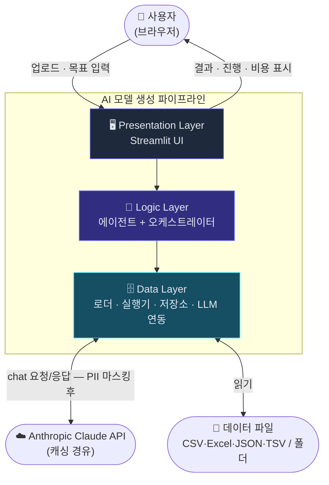
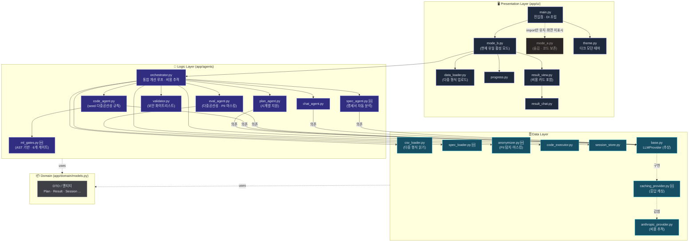
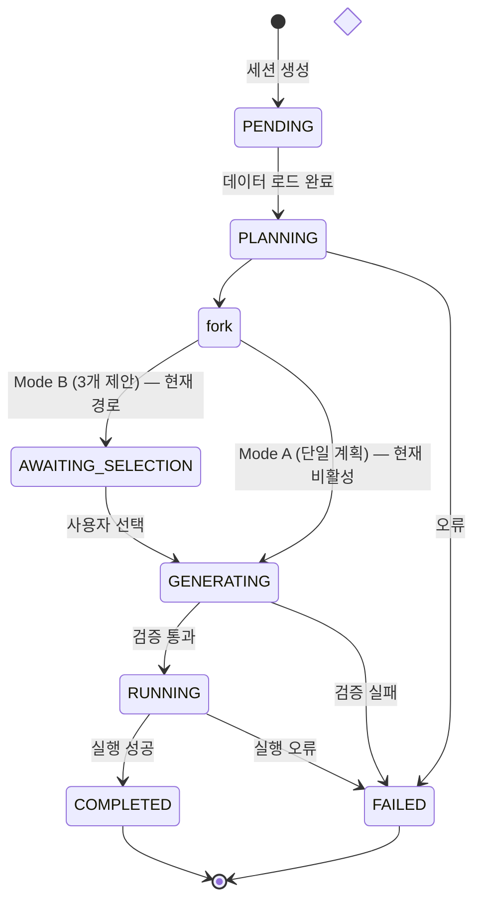
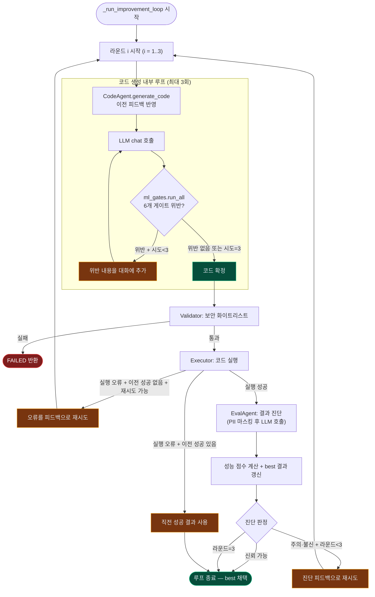
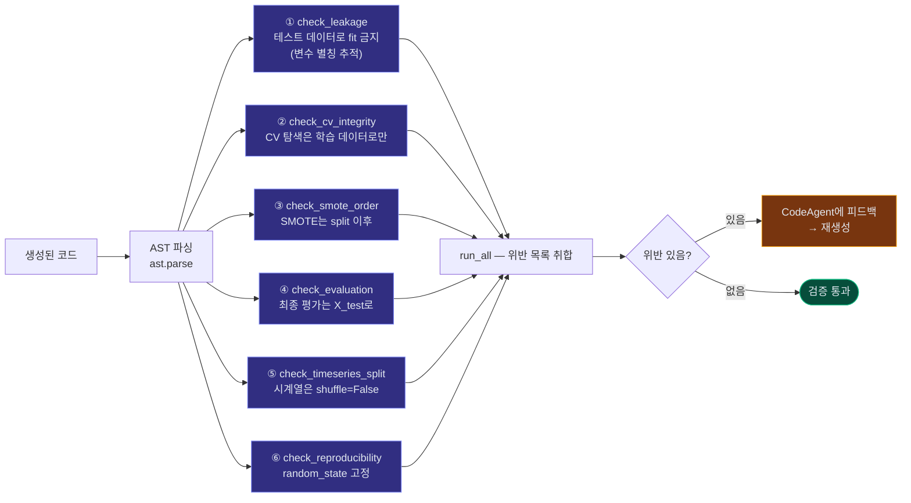
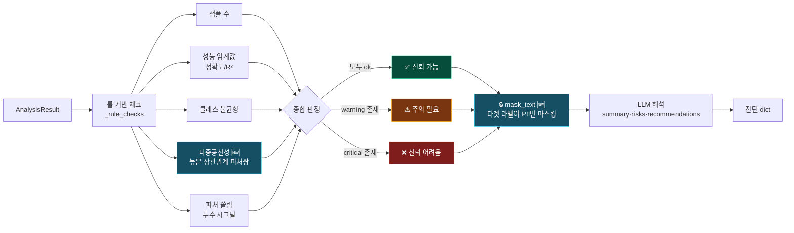
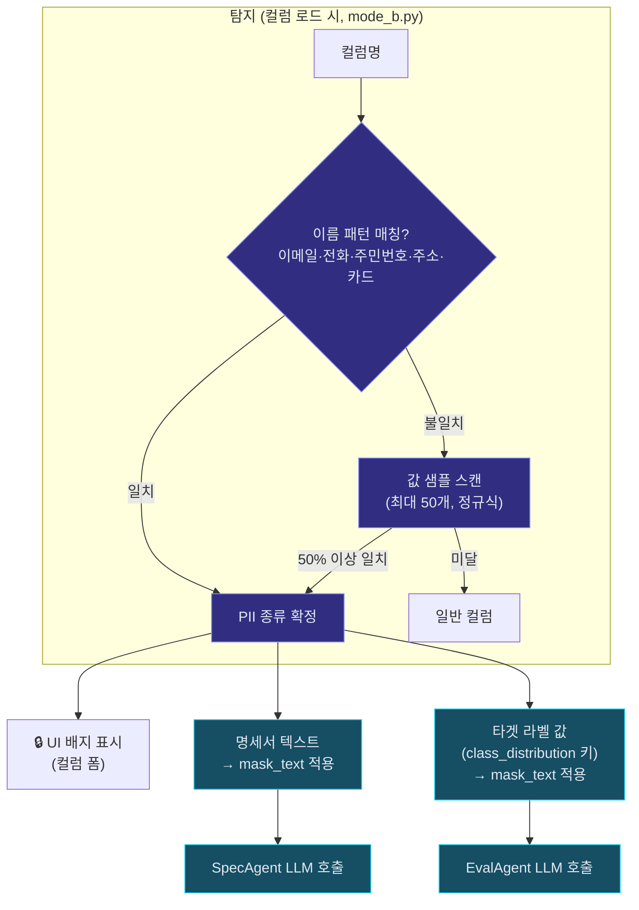
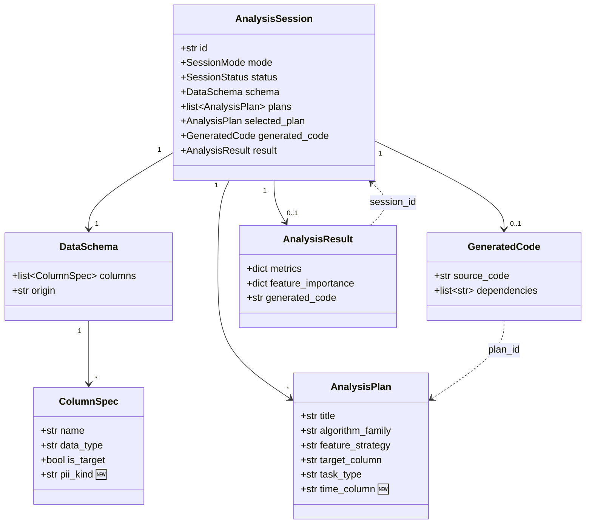
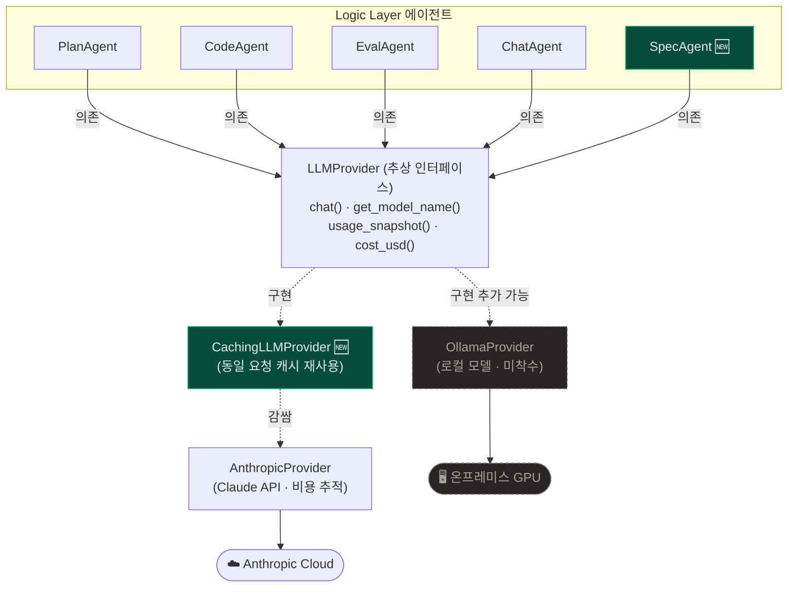

# 아키텍처 다이어그램 (Mermaid)

> 시스템 구조를 Mermaid로 시각화한 문서. GitHub·VS Code(Mermaid 확장)·Obsidian 등에서 렌더링된다.
> 텍스트 상세는 [`ARCHITECTURE.md`](./ARCHITECTURE.md)를 참고하라.
> 🆕 표시는 최초 작성 이후 추가된 컴포넌트/체크를 뜻한다.

---

## 1. 시스템 컨텍스트 (전체 조감)

---

## 2. 3-Tier 컴포넌트 구조

---

## 3. Mode B 전체 파이프라인 시퀀스 (현재 유일 활성 흐름)

```mermaid
sequenceDiagram
    autonumber
    actor U as 사용자
    participant UI as mode_b (UI)
    participant O as Orchestrator
    participant AN as anonymizer
    participant SA as SpecAgent
    participant PA as PlanAgent
    participant ST as SessionStore
    participant IMP as 통합 개선 루프
    participant LLM as Claude API (캐싱 경유)

    rect rgb(30,41,59)
    Note over U,LLM: 0단계 — 데이터 불러오기 + (선택) 명세서 자동 분석
    U->>UI: 데이터 파일 업로드 (CSV/Excel/JSON/TSV 등)
    UI->>UI: 컬럼 자동 감지 + PII 스캔(anonymizer)
    opt 명세서 파일 첨부됨
        UI->>O: parse_spec(columns, spec_text)
        O->>AN: mask_text(spec_text)
        AN-->>O: 마스킹된 텍스트
        O->>SA: extract(columns, masked_text)
        SA->>LLM: chat (컬럼 설명·타겟·유형 추출)
        LLM-->>SA: JSON
        SA-->>O: 컬럼 설명 + 타겟 + task_type
        O-->>UI: 폼 자동 채움 + 분석 비용
    end
    UI->>U: 컬럼 폼 표시 (🔒PII 배지 포함)
    end

    rect rgb(238,242,255)
    Note over U,LLM: 1단계 — 분석 방향 3개 제안
    U->>UI: 타겟·유형 확정 + [제안받기]
    UI->>O: propose_plans(request)
    O->>PA: propose_plans_mode_b(schema, task_type, time_column)
    loop 서로 다른 알고리즘 3개 보장 (최대 3회)
        PA->>LLM: chat (3개 계획 요청)
        LLM-->>PA: JSON 배열
    end
    PA-->>O: [Plan1, Plan2, Plan3]
    O->>ST: save(session, AWAITING_SELECTION)
    O-->>UI: 3개 방향 + 계획 수립 비용
    UI->>U: 방향 라디오 표시
    end

    rect rgb(236,254,255)
    Note over U,LLM: 2단계 — 선택 실행 (통합 개선 루프, 최대 3라운드)
    U->>UI: 방향 선택 + [분석 시작]
    UI->>O: execute_selected_plan(session_id, plan_id)
    O->>ST: get(session_id)
    loop 최대 3라운드 — 성능 개선 또는 '신뢰 가능' 판정까지
        O->>IMP: 코드생성 — 게이트 검증 → 실행 → 진단
        IMP->>LLM: chat (코드 생성, 위반 시 재생성 최대 3회)
        IMP->>LLM: chat (결과 진단 해석)
        IMP-->>O: 결과 + 성능 점수 + 진단 verdict
        O-->>UI: 라운드별 성능 · 비용(⚡캐시 재사용 시 $0)
    end
    O-->>UI: 가장 성능 좋은 결과 채택 + 총 비용
    UI->>U: 결과 6탭(비용 카드 포함) + 챗봇
    end
```

> Mode A(자연어 목표 입력)는 `run_mode_a()`로 코드가 남아있지만 현재 UI에서 숨겨져 있다. 흐름은 위 1·2단계를 하나로 합친 것과 동일하다(사용자 선택 단계만 없음).

---

## 4. 세션 상태 머신

> `GENERATING ↔ RUNNING` 구간은 이제 내부적으로 최대 3라운드 반복되지만(통합 개선 루프), 세션 레벨에서 보이는 상태 자체는 동일하다 — 반복은 상태 전이가 아니라 같은 상태 안에서의 재시도이기 때문이다.

---

## 5. 통합 개선 루프 (Orchestrator._run_improvement_loop)

**교체 이력**: 이전에는 "코드 생성 재시도 루프"(회색 `GATE` 서브그래프만) 하나뿐이었다. 지금은 그 바깥에 **전처리·모델 개선을 포괄하는 3라운드 루프**가 추가되어 이중 구조가 됐다 — 안쪽 루프는 "규칙 위반 여부", 바깥 루프는 "성능이 충분히 좋은가"를 본다.

---

## 6. ML 방법론 게이트 6종 (AST 기반)

**정규식 → AST 전환 이유**: 정규식은 `X_test`라는 리터럴 문자열만 찾아서, `xt = X_test` 후 `xt`를 쓰면 우회됐다. AST는 sklearn의 고정 반환 순서(`train, test, train, test`)로 실제 역할을 판별하고 변수 별칭 체인을 끝까지 추적하므로 이름을 바꿔도 탐지된다. ⑤·⑥은 이번에 새로 추가된 게이트다.

---

## 7. 결과 진단 로직 (EvalAgent)

---

## 8. 개인정보(PII) 탐지·마스킹 흐름 🆕

> 코드 실행(`exec()`) 자체는 로컬이라 데이터가 밖으로 안 나간다. 이 흐름은 LLM에 텍스트가 실리는 **두 지점**(명세서 분석, 결과 진단)만 막는다.

---

## 9. 도메인 모델 관계

> `task_type`은 이제 `"classification" | "regression" | "timeseries"` 세 가지다. `metrics`(딕셔너리)에는 실행마다 `__eval`(진단), `__cost`(비용) 키가 추가로 담긴다.

---

## 10. LLM 교체 및 캐싱 지점 (보안 환경 대응 + 재현성)

> 에이전트는 여전히 `LLMProvider` 인터페이스에만 의존한다. `CachingLLMProvider`는 그 인터페이스를 감싸는 데코레이터라 `AnthropicProvider`뿐 아니라 향후 `OllamaProvider`에도 그대로 씌울 수 있다. 상세는 [`deployment-and-local-model.md`](./deployment-and-local-model.md) 참고.
